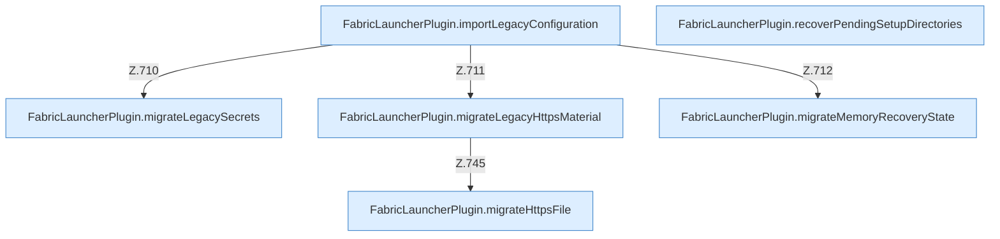

[[00 Start]] › [[Plugin-Kern]] › [[Setup]] › [[Setup-Import]]

# Setup-Import

```mermaid
flowchart TD
  n1["FabricLauncherPlugin.importLegacyConfiguration"]:::internal-link
  n2["FabricLauncherPlugin.migrateLegacySecrets"]:::internal-link
  n3["FabricLauncherPlugin.migrateLegacyHttpsMaterial"]:::internal-link
  n4["FabricLauncherPlugin.migrateHttpsFile"]:::internal-link
  n5["FabricLauncherPlugin.migrateMemoryRecoveryState"]:::internal-link
  n6["FabricLauncherPlugin.recoverPendingSetupDirectories"]:::internal-link
  n1 -->|"Z.710"| n2
  n1 -->|"Z.711"| n3
  n1 -->|"Z.712"| n5
  n3 -->|"Z.745"| n4
  classDef internal-link fill:#ddeeff,stroke:#4488cc
  classDef befund fill:#f88
```

