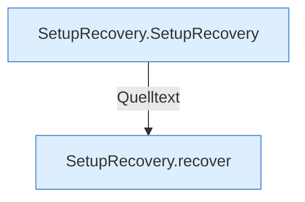

[[00 Start]] › [[Server-Anlage]] › [[Setup-Suche]] › [[SetupRecovery]]

# SetupRecovery

```mermaid
flowchart TD
  n1["SetupRecovery.SetupRecovery"]:::internal-link
  n2["SetupRecovery.recover"]:::internal-link
  n1 -->|"Quelltext"| n2
  classDef internal-link fill:#ddeeff,stroke:#4488cc
  classDef befund fill:#f88
```

