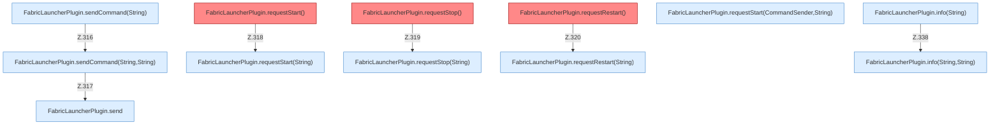

[[00 Start]] › [[Plugin-Kern]] › [[Slot-Aktionen]]

# Slot-Aktionen

```mermaid
flowchart TD
  n1["FabricLauncherPlugin.sendCommand(String)"]:::internal-link
  n2["FabricLauncherPlugin.sendCommand(String,String)"]:::internal-link
  n3["FabricLauncherPlugin.requestStart()"]:::internal-link
  n4["FabricLauncherPlugin.requestStop()"]:::internal-link
  n5["FabricLauncherPlugin.requestRestart()"]:::internal-link
  n6["FabricLauncherPlugin.requestStart(String)"]:::internal-link
  n7["FabricLauncherPlugin.requestStart(CommandSender,String)"]:::internal-link
  n8["FabricLauncherPlugin.requestStop(String)"]:::internal-link
  n9["FabricLauncherPlugin.requestRestart(String)"]:::internal-link
  n10["FabricLauncherPlugin.info(String)"]:::internal-link
  n11["FabricLauncherPlugin.info(String,String)"]:::internal-link
  n12["FabricLauncherPlugin.send"]:::internal-link
  n1 -->|"Z.316"| n2
  n2 -->|"Z.317"| n12
  n3 -->|"Z.318"| n6
  n4 -->|"Z.319"| n8
  n5 -->|"Z.320"| n9
  n10 -->|"Z.338"| n11
  classDef internal-link fill:#ddeeff,stroke:#4488cc
  classDef befund fill:#f88
  style n3 fill:#f88,stroke:#900
  style n4 fill:#f88,stroke:#900
  style n5 fill:#f88,stroke:#900
```

