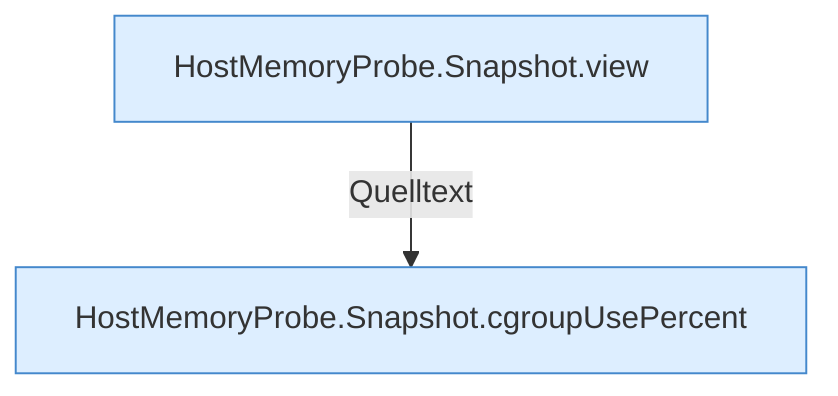

[[00 Start]] › [[Host-Betrieb]] › [[Speicher-Messung]] › [[HostMemoryProbe]] › [[Snapshot]]

# Snapshot

```mermaid
flowchart TD
  n1["HostMemoryProbe.Snapshot.view"]:::internal-link
  n2["HostMemoryProbe.Snapshot.cgroupUsePercent"]:::internal-link
  n1 -->|"Quelltext"| n2
  classDef internal-link fill:#ddeeff,stroke:#4488cc
  classDef befund fill:#f88
```

