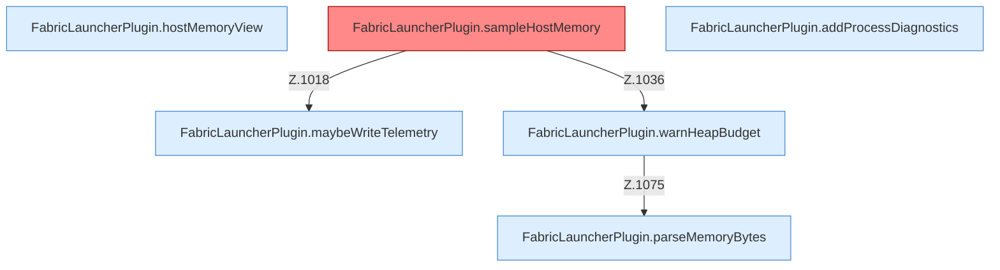

[[00 Start]] › [[Host-Betrieb]] › [[Speicher-Probe]]

# Speicher-Probe

```mermaid
flowchart TD
  n1["FabricLauncherPlugin.hostMemoryView"]:::internal-link
  n2["FabricLauncherPlugin.maybeWriteTelemetry"]:::internal-link
  n3["FabricLauncherPlugin.sampleHostMemory"]:::internal-link
  n4["FabricLauncherPlugin.warnHeapBudget"]:::internal-link
  n5["FabricLauncherPlugin.parseMemoryBytes"]:::internal-link
  n6["FabricLauncherPlugin.addProcessDiagnostics"]:::internal-link
  n3 -->|"Z.1018"| n2
  n3 -->|"Z.1036"| n4
  n4 -->|"Z.1075"| n5
  classDef internal-link fill:#ddeeff,stroke:#4488cc
  classDef befund fill:#f88
  style n3 fill:#f88,stroke:#900
```

