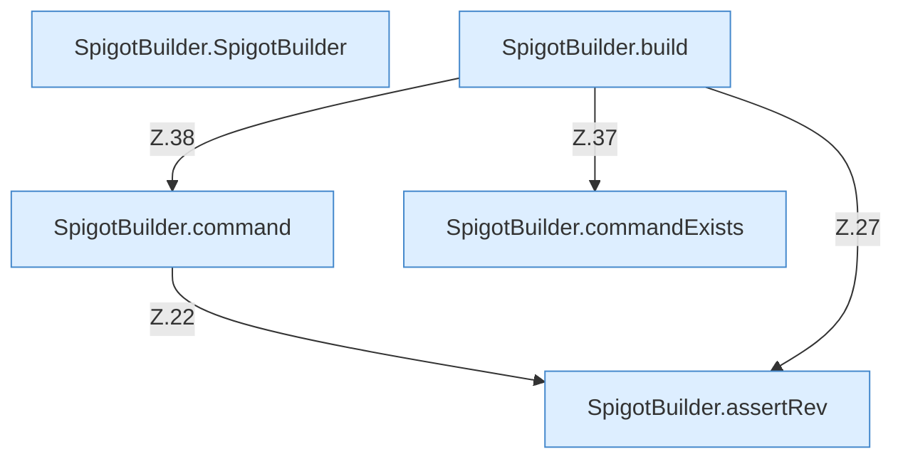

[[00 Start]] › [[Server-Anlage]] › [[Startplan]] › [[SpigotBuilder]]

# SpigotBuilder

```mermaid
flowchart TD
  n1["SpigotBuilder.SpigotBuilder"]:::internal-link
  n2["SpigotBuilder.assertRev"]:::internal-link
  n3["SpigotBuilder.command"]:::internal-link
  n4["SpigotBuilder.build"]:::internal-link
  n5["SpigotBuilder.commandExists"]:::internal-link
  n3 -->|"Z.22"| n2
  n4 -->|"Z.27"| n2
  n4 -->|"Z.37"| n5
  n4 -->|"Z.38"| n3
  classDef internal-link fill:#ddeeff,stroke:#4488cc
  classDef befund fill:#f88
```

