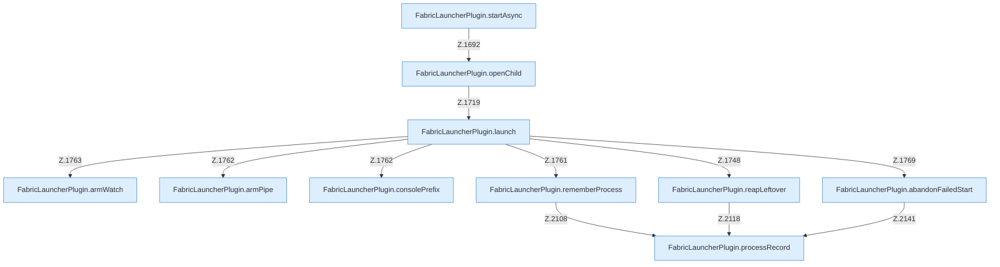

[[00 Start]] › [[Child-Prozess]] › [[Startablauf]]

# Startablauf

```mermaid
flowchart TD
  n1["FabricLauncherPlugin.startAsync"]:::internal-link
  n2["FabricLauncherPlugin.openChild"]:::internal-link
  n3["FabricLauncherPlugin.launch"]:::internal-link
  n4["FabricLauncherPlugin.armWatch"]:::internal-link
  n5["FabricLauncherPlugin.armPipe"]:::internal-link
  n6["FabricLauncherPlugin.consolePrefix"]:::internal-link
  n7["FabricLauncherPlugin.processRecord"]:::internal-link
  n8["FabricLauncherPlugin.rememberProcess"]:::internal-link
  n9["FabricLauncherPlugin.reapLeftover"]:::internal-link
  n10["FabricLauncherPlugin.abandonFailedStart"]:::internal-link
  n1 -->|"Z.1692"| n2
  n2 -->|"Z.1719"| n3
  n3 -->|"Z.1748"| n9
  n3 -->|"Z.1761"| n8
  n3 -->|"Z.1762"| n5
  n3 -->|"Z.1762"| n6
  n3 -->|"Z.1763"| n4
  n3 -->|"Z.1769"| n10
  n8 -->|"Z.2108"| n7
  n9 -->|"Z.2118"| n7
  n10 -->|"Z.2141"| n7
  classDef internal-link fill:#ddeeff,stroke:#4488cc
  classDef befund fill:#f88
```

- `startAsync` reicht an `launch`: Dateien, Prozess, Pipes, Watch.
