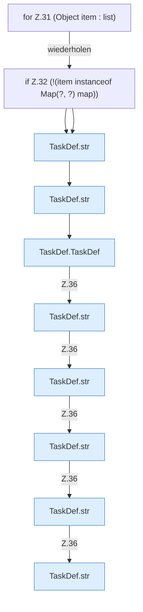

[[00 Start]] › [[Zeitplaene]] › [[Plan-Klassen]] › [[TaskDef]] › [[TaskDef.load]] › [[TaskDef.load.Z31]]

# TaskDef.load.Z31

```mermaid
flowchart TD
  n1["for Z.31 (Object item : list)"]
  n2["if Z.32 (!(item instanceof Map(?, ?) map))"]
  n3["TaskDef.str"]:::internal-link
  n4["TaskDef.str"]:::internal-link
  n5["TaskDef.TaskDef"]:::internal-link
  n6["TaskDef.str"]:::internal-link
  n7["TaskDef.str"]:::internal-link
  n8["TaskDef.str"]:::internal-link
  n9["TaskDef.str"]:::internal-link
  n10["TaskDef.str"]:::internal-link
  n2 --> n3
  n2 --> n3
  n3 --> n4
  n5 -->|"Z.36"| n6
  n6 -->|"Z.36"| n7
  n7 -->|"Z.36"| n8
  n8 -->|"Z.36"| n9
  n9 -->|"Z.36"| n10
  n4 --> n5
  n1 -->|"wiederholen"| n2
  classDef internal-link fill:#ddeeff,stroke:#4488cc
  classDef befund fill:#f88
```

- Fortsetzung von `TaskDef.load`, Quellreihenfolge.
