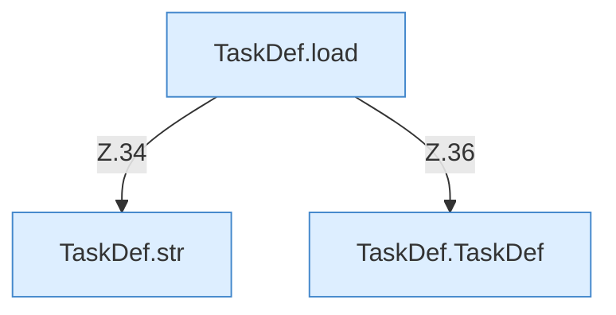

[[00 Start]] › [[Zeitplaene]] › [[Plan-Klassen]] › [[TaskDef]]

# TaskDef

```mermaid
flowchart TD
  n1["TaskDef.TaskDef"]:::internal-link
  n2["TaskDef.load"]:::internal-link
  n3["TaskDef.str"]:::internal-link
  n2 -->|"Z.34"| n3
  n2 -->|"Z.36"| n1
  classDef internal-link fill:#ddeeff,stroke:#4488cc
  classDef befund fill:#f88
```

