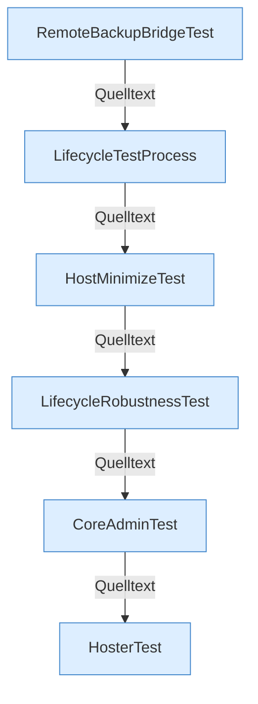

[[00 Start]] › [[Tests]]

# Tests

```mermaid
flowchart TD
  n1["RemoteBackupBridgeTest"]:::internal-link
  n2["LifecycleTestProcess"]:::internal-link
  n3["HostMinimizeTest"]:::internal-link
  n4["LifecycleRobustnessTest"]:::internal-link
  n5["CoreAdminTest"]:::internal-link
  n6["HosterTest"]:::internal-link
  n1 -->|"Quelltext"| n2
  n2 -->|"Quelltext"| n3
  n3 -->|"Quelltext"| n4
  n4 -->|"Quelltext"| n5
  n5 -->|"Quelltext"| n6
  classDef internal-link fill:#ddeeff,stroke:#4488cc
  classDef befund fill:#f88
```

- JUnit unter `src/test`. Erreichbar, damit keine Testmethode als Lücke gilt.
