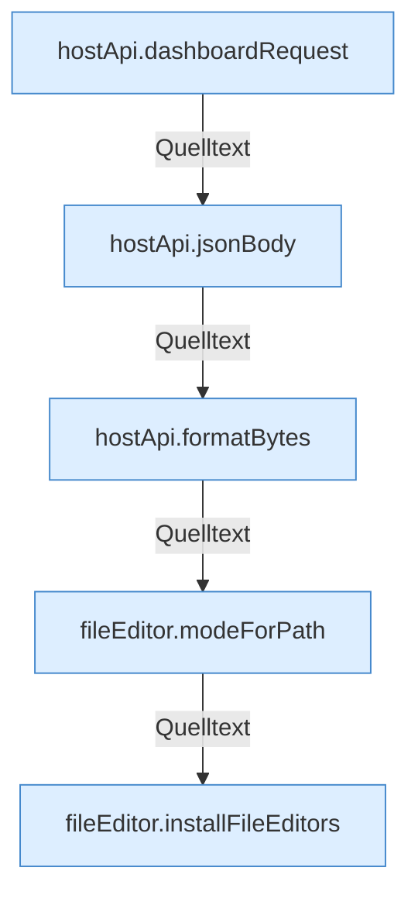

[[00 Start]] › [[Dashboard-UI]] › [[UI-Client]]

# UI-Client

```mermaid
flowchart TD
  n1["hostApi.dashboardRequest"]:::internal-link
  n2["hostApi.jsonBody"]:::internal-link
  n3["hostApi.formatBytes"]:::internal-link
  n4["fileEditor.modeForPath"]:::internal-link
  n5["fileEditor.installFileEditors"]:::internal-link
  n1 -->|"Quelltext"| n2
  n2 -->|"Quelltext"| n3
  n3 -->|"Quelltext"| n4
  n4 -->|"Quelltext"| n5
  classDef internal-link fill:#ddeeff,stroke:#4488cc
  classDef befund fill:#f88
```

