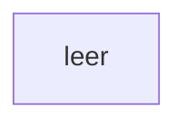

[[00 Start]] › [[Dashboard-UI]] › [[UI-Start]]

# UI-Start


```mermaid
flowchart TD
  n1["leer"]
  classDef internal-link fill:#ddeeff,stroke:#4488cc
  classDef befund fill:#f88
```

```knoten
leer
  Keine weiteren Knoten.
```

- `ui/src/main.tsx` ruft `createRoot` und rendert `App`. Kein benannter Funktionsrumpf.
