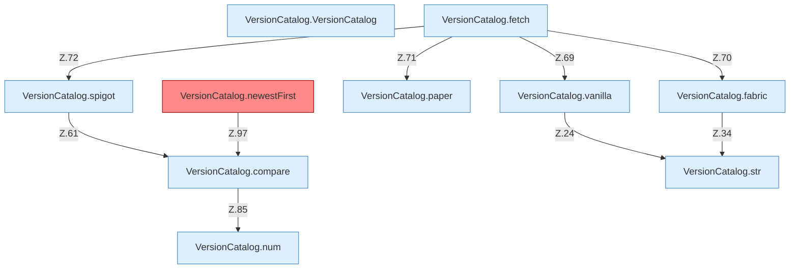

[[00 Start]] › [[Server-Anlage]] › [[Versionen]] › [[VersionCatalog]]

# VersionCatalog

```mermaid
flowchart TD
  n1["VersionCatalog.VersionCatalog"]:::internal-link
  n2["VersionCatalog.vanilla"]:::internal-link
  n3["VersionCatalog.fabric"]:::internal-link
  n4["VersionCatalog.paper"]:::internal-link
  n5["VersionCatalog.spigot"]:::internal-link
  n6["VersionCatalog.fetch"]:::internal-link
  n7["VersionCatalog.compare"]:::internal-link
  n8["VersionCatalog.num"]:::internal-link
  n9["VersionCatalog.str"]:::internal-link
  n10["VersionCatalog.newestFirst"]:::internal-link
  n2 -->|"Z.24"| n9
  n3 -->|"Z.34"| n9
  n5 -->|"Z.61"| n7
  n6 -->|"Z.69"| n2
  n6 -->|"Z.70"| n3
  n6 -->|"Z.71"| n4
  n6 -->|"Z.72"| n5
  n7 -->|"Z.85"| n8
  n10 -->|"Z.97"| n7
  classDef internal-link fill:#ddeeff,stroke:#4488cc
  classDef befund fill:#f88
  style n10 fill:#f88,stroke:#900
```

