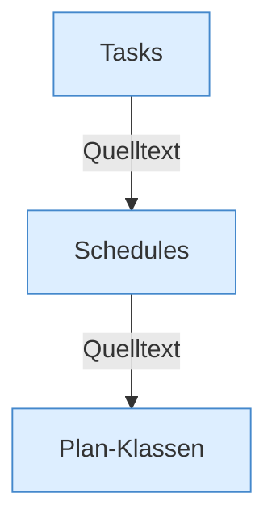

[[00 Start]] › [[Zeitplaene]]

# Zeitplaene

```mermaid
flowchart TD
  n1["Tasks"]:::internal-link
  n2["Schedules"]:::internal-link
  n3["Plan-Klassen"]:::internal-link
  n1 -->|"Quelltext"| n2
  n2 -->|"Quelltext"| n3
  classDef internal-link fill:#ddeeff,stroke:#4488cc
  classDef befund fill:#f88
```

- `schedules` und daneben weiter `tasks` alle 20 s.
- Befund: Altlast (sicher)
