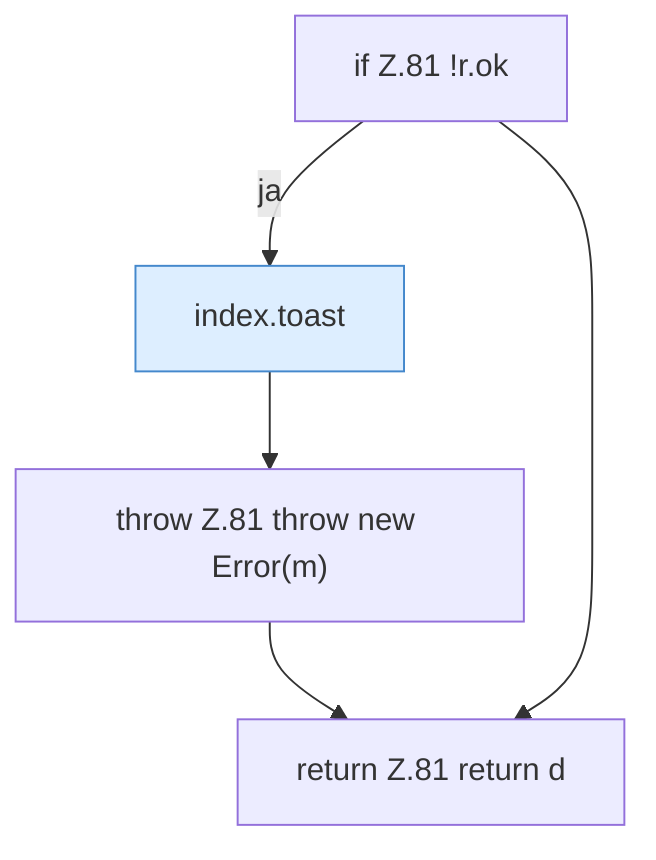

[[00 Start]] › [[Dashboard-UI]] › [[Legacy-Sitzung]] › [[index.api]] › [[index.api.Teil2]]

# index.api.Teil2

```mermaid
flowchart TD
  n1["if Z.81 !r.ok"]
  n2["index.toast"]:::internal-link
  n3["throw Z.81 throw new Error(m)"]
  n4["return Z.81 return d"]
  n2 --> n3
  n1 -->|"ja"| n2
  n3 --> n4
  n1 --> n4
  classDef internal-link fill:#ddeeff,stroke:#4488cc
  classDef befund fill:#f88
```

- Fortsetzung von `index.api`, Quellreihenfolge.
