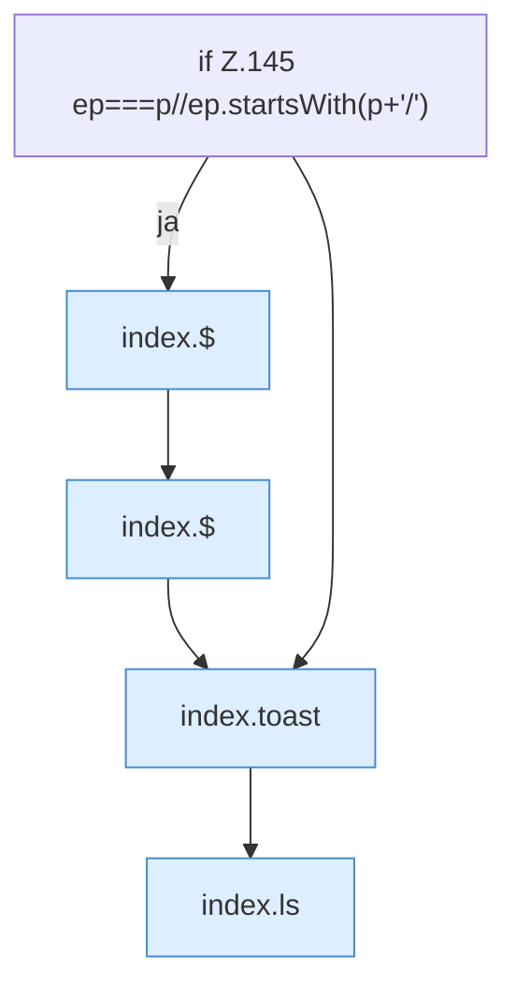

[[00 Start]] › [[Dashboard-UI]] › [[Legacy-Dateien]] › [[index.del]] › [[index.del.Teil2]]

# index.del.Teil2

```mermaid
flowchart TD
  n1["if Z.145 ep===p//ep.startsWith(p+'/')"]
  n2["index.$"]:::internal-link
  n3["index.$"]:::internal-link
  n4["index.toast"]:::internal-link
  n5["index.ls"]:::internal-link
  n2 --> n3
  n1 -->|"ja"| n2
  n3 --> n4
  n1 --> n4
  n4 --> n5
  classDef internal-link fill:#ddeeff,stroke:#4488cc
  classDef befund fill:#f88
```

- Fortsetzung von `index.del`, Quellreihenfolge.
