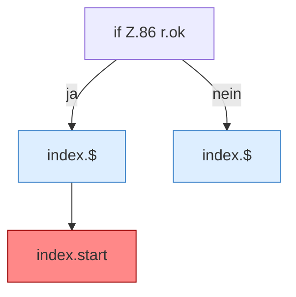

[[00 Start]] › [[Dashboard-UI]] › [[Legacy-Sitzung]] › [[index.doLogin]] › [[index.doLogin.Z86]]

# index.doLogin.Z86

```mermaid
flowchart TD
  n1["if Z.86 r.ok"]
  n2["index.$"]:::internal-link
  n3["index.start"]:::internal-link
  n4["index.$"]:::internal-link
  n2 --> n3
  n1 -->|"ja"| n2
  n1 -->|"nein"| n4
  classDef internal-link fill:#ddeeff,stroke:#4488cc
  classDef befund fill:#f88
  style n3 fill:#f88,stroke:#900
```

- Fortsetzung von `index.doLogin`, Quellreihenfolge.
