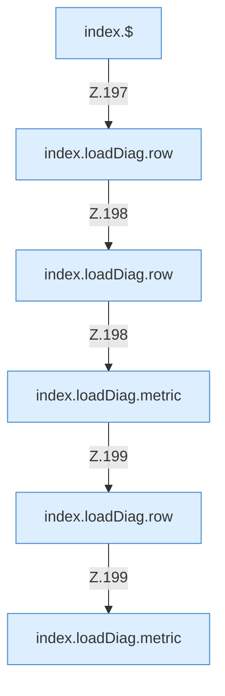

[[00 Start]] › [[Dashboard-UI]] › [[Legacy-Diag]] › [[index.loadDiag]] › [[index.loadDiag.Calls196]]

# index.loadDiag.Calls196

```mermaid
flowchart TD
  n1["index.$"]:::internal-link
  n2["index.loadDiag.row"]:::internal-link
  n3["index.loadDiag.row"]:::internal-link
  n4["index.loadDiag.metric"]:::internal-link
  n5["index.loadDiag.row"]:::internal-link
  n6["index.loadDiag.metric"]:::internal-link
  n1 -->|"Z.197"| n2
  n2 -->|"Z.198"| n3
  n3 -->|"Z.198"| n4
  n4 -->|"Z.199"| n5
  n5 -->|"Z.199"| n6
  classDef internal-link fill:#ddeeff,stroke:#4488cc
  classDef befund fill:#f88
```

- Fortsetzung von `index.loadDiag`, Quellreihenfolge.
