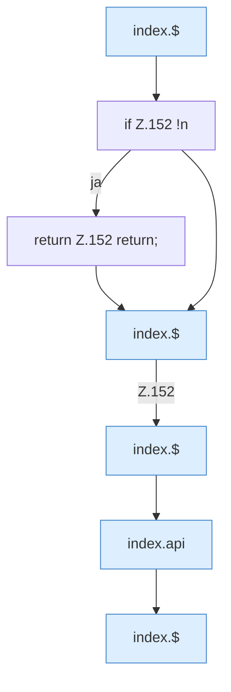

[[00 Start]] › [[Dashboard-UI]] › [[Legacy-Logs]] › [[index.loadLog]] › [[index.loadLog.Teil1]]

# index.loadLog.Teil1

```mermaid
flowchart TD
  n1["index.$"]:::internal-link
  n2["if Z.152 !n"]
  n3["return Z.152 return;"]
  n4["index.$"]:::internal-link
  n5["index.$"]:::internal-link
  n6["index.api"]:::internal-link
  n7["index.$"]:::internal-link
  n2 -->|"ja"| n3
  n1 --> n2
  n4 -->|"Z.152"| n5
  n3 --> n4
  n2 --> n4
  n5 --> n6
  n6 --> n7
  classDef internal-link fill:#ddeeff,stroke:#4488cc
  classDef befund fill:#f88
```

- Fortsetzung von `index.loadLog`, Quellreihenfolge.
