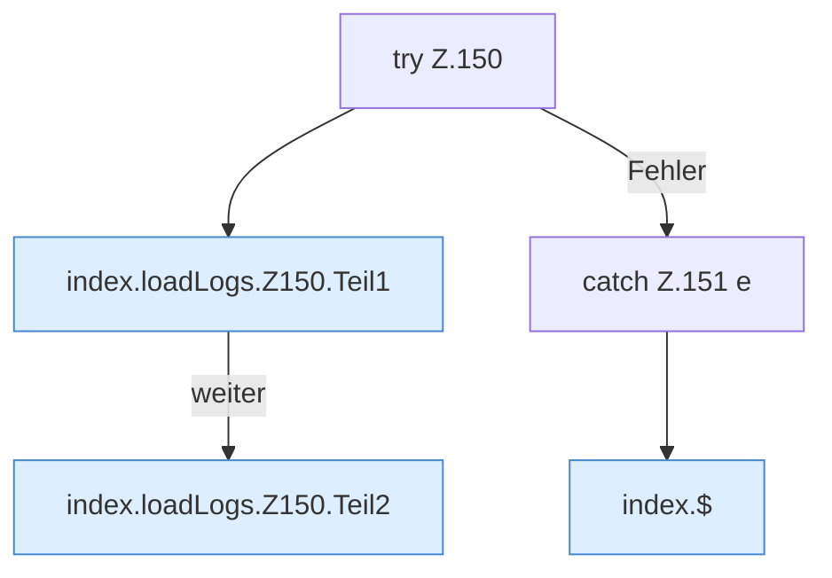

[[00 Start]] › [[Dashboard-UI]] › [[Legacy-Logs]] › [[index.loadLogs]] › [[index.loadLogs.Z150]]

# index.loadLogs.Z150

```mermaid
flowchart TD
  n1["try Z.150"]
  n2["index.loadLogs.Z150.Teil1"]:::internal-link
  n3["index.loadLogs.Z150.Teil2"]:::internal-link
  n4["catch Z.151 e"]
  n5["index.$"]:::internal-link
  n2 -->|"weiter"| n3
  n1 --> n2
  n1 -->|"Fehler"| n4
  n4 --> n5
  classDef internal-link fill:#ddeeff,stroke:#4488cc
  classDef befund fill:#f88
```

- Fortsetzung von `index.loadLogs`, Quellreihenfolge.
