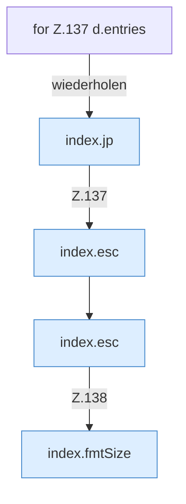

[[00 Start]] › [[Dashboard-UI]] › [[Legacy-Dateien]] › [[index.ls]] › [[index.ls.Teil2.Z137]]

# index.ls.Teil2.Z137

```mermaid
flowchart TD
  n1["for Z.137 d.entries"]
  n2["index.jp"]:::internal-link
  n3["index.esc"]:::internal-link
  n4["index.esc"]:::internal-link
  n5["index.fmtSize"]:::internal-link
  n2 -->|"Z.137"| n3
  n4 -->|"Z.138"| n5
  n3 --> n4
  n1 -->|"wiederholen"| n2
  classDef internal-link fill:#ddeeff,stroke:#4488cc
  classDef befund fill:#f88
```

- Fortsetzung von `index.ls.Teil2`, Quellreihenfolge.
