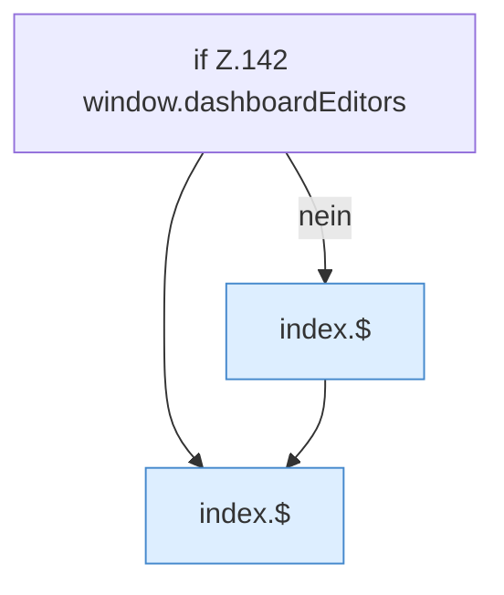

[[00 Start]] › [[Dashboard-UI]] › [[Legacy-Dateien]] › [[index.openFile]] › [[index.openFile.Teil2]]

# index.openFile.Teil2

```mermaid
flowchart TD
  n1["if Z.142 window.dashboardEditors"]
  n2["index.$"]:::internal-link
  n3["index.$"]:::internal-link
  n1 -->|"nein"| n2
  n1 --> n3
  n2 --> n3
  classDef internal-link fill:#ddeeff,stroke:#4488cc
  classDef befund fill:#f88
```

- Fortsetzung von `index.openFile`, Quellreihenfolge.
