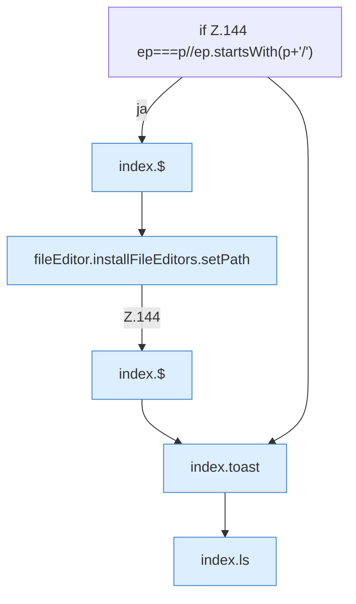

[[00 Start]] › [[Dashboard-UI]] › [[Legacy-Dateien]] › [[index.ren]] › [[index.ren.Teil2]]

# index.ren.Teil2

```mermaid
flowchart TD
  n1["if Z.144 ep===p//ep.startsWith(p+'/')"]
  n2["index.$"]:::internal-link
  n3["fileEditor.installFileEditors.setPath"]:::internal-link
  n4["index.$"]:::internal-link
  n5["index.toast"]:::internal-link
  n6["index.ls"]:::internal-link
  n3 -->|"Z.144"| n4
  n2 --> n3
  n1 -->|"ja"| n2
  n4 --> n5
  n1 --> n5
  n5 --> n6
  classDef internal-link fill:#ddeeff,stroke:#4488cc
  classDef befund fill:#f88
```

- Fortsetzung von `index.ren`, Quellreihenfolge.
