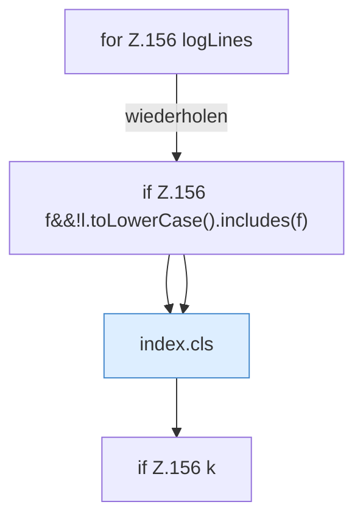

[[00 Start]] › [[Dashboard-UI]] › [[Legacy-Logs]] › [[index.renderLog]] › [[index.renderLog.Z156]]

# index.renderLog.Z156

```mermaid
flowchart TD
  n1["for Z.156 logLines"]
  n2["if Z.156 f&&!l.toLowerCase().includes(f)"]
  n3["index.cls"]:::internal-link
  n4["if Z.156 k"]
  n2 --> n3
  n2 --> n3
  n3 --> n4
  n1 -->|"wiederholen"| n2
  classDef internal-link fill:#ddeeff,stroke:#4488cc
  classDef befund fill:#f88
```

- Fortsetzung von `index.renderLog`, Quellreihenfolge.
