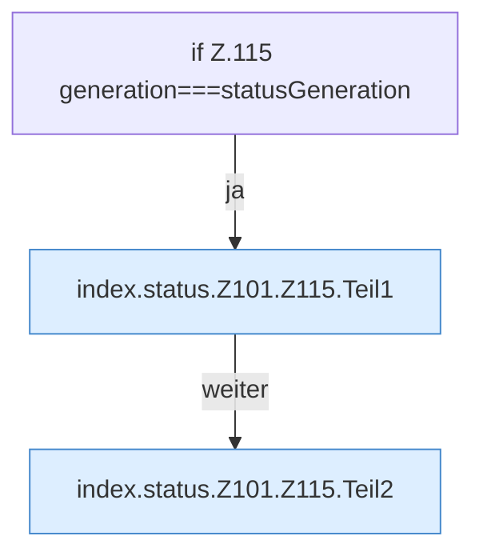

[[00 Start]] › [[Dashboard-UI]] › [[Legacy-Status]] › [[index.status]] › [[index.status.Z101.Z115]]

# index.status.Z101.Z115

```mermaid
flowchart TD
  n1["if Z.115 generation===statusGeneration"]
  n2["index.status.Z101.Z115.Teil1"]:::internal-link
  n3["index.status.Z101.Z115.Teil2"]:::internal-link
  n2 -->|"weiter"| n3
  n1 -->|"ja"| n2
  classDef internal-link fill:#ddeeff,stroke:#4488cc
  classDef befund fill:#f88
```

- Fortsetzung von `index.status.Z101`, Quellreihenfolge.
