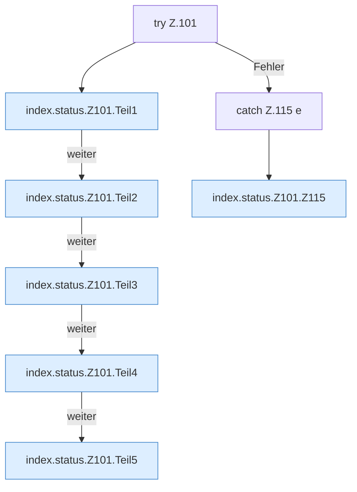

[[00 Start]] › [[Dashboard-UI]] › [[Legacy-Status]] › [[index.status]] › [[index.status.Z101]]

# index.status.Z101

```mermaid
flowchart TD
  n1["try Z.101"]
  n2["index.status.Z101.Teil1"]:::internal-link
  n3["index.status.Z101.Teil2"]:::internal-link
  n4["index.status.Z101.Teil3"]:::internal-link
  n5["index.status.Z101.Teil4"]:::internal-link
  n6["index.status.Z101.Teil5"]:::internal-link
  n7["catch Z.115 e"]
  n8["index.status.Z101.Z115"]:::internal-link
  n2 -->|"weiter"| n3
  n3 -->|"weiter"| n4
  n4 -->|"weiter"| n5
  n5 -->|"weiter"| n6
  n1 --> n2
  n1 -->|"Fehler"| n7
  n7 --> n8
  classDef internal-link fill:#ddeeff,stroke:#4488cc
  classDef befund fill:#f88
```

- Fortsetzung von `index.status`, Quellreihenfolge.
