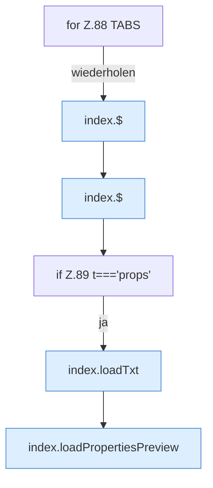

[[00 Start]] › [[Dashboard-UI]] › [[Legacy-Sitzung]] › [[index.tab]] › [[index.tab.Teil1]]

# index.tab.Teil1

```mermaid
flowchart TD
  n1["for Z.88 TABS"]
  n2["index.$"]:::internal-link
  n3["index.$"]:::internal-link
  n4["if Z.89 t==='props'"]
  n5["index.loadTxt"]:::internal-link
  n6["index.loadPropertiesPreview"]:::internal-link
  n2 --> n3
  n1 -->|"wiederholen"| n2
  n5 --> n6
  n4 -->|"ja"| n5
  n3 --> n4
  classDef internal-link fill:#ddeeff,stroke:#4488cc
  classDef befund fill:#f88
```

- Fortsetzung von `index.tab`, Quellreihenfolge.
