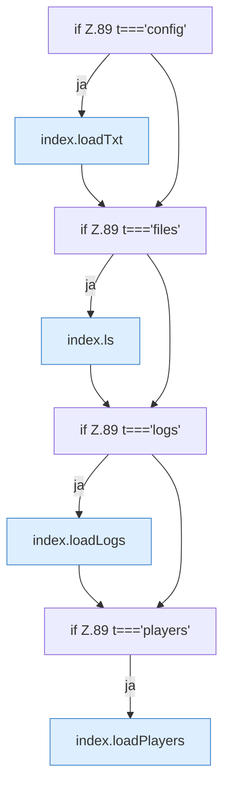

[[00 Start]] › [[Dashboard-UI]] › [[Legacy-Sitzung]] › [[index.tab]] › [[index.tab.Teil2]]

# index.tab.Teil2

```mermaid
flowchart TD
  n1["if Z.89 t==='config'"]
  n2["index.loadTxt"]:::internal-link
  n3["if Z.89 t==='files'"]
  n4["index.ls"]:::internal-link
  n5["if Z.89 t==='logs'"]
  n6["index.loadLogs"]:::internal-link
  n7["if Z.89 t==='players'"]
  n8["index.loadPlayers"]:::internal-link
  n1 -->|"ja"| n2
  n3 -->|"ja"| n4
  n2 --> n3
  n1 --> n3
  n5 -->|"ja"| n6
  n4 --> n5
  n3 --> n5
  n7 -->|"ja"| n8
  n6 --> n7
  n5 --> n7
  classDef internal-link fill:#ddeeff,stroke:#4488cc
  classDef befund fill:#f88
```

- Fortsetzung von `index.tab`, Quellreihenfolge.
