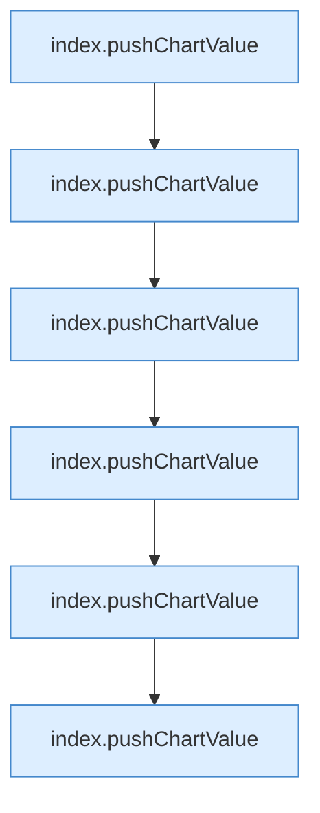

[[00 Start]] › [[Dashboard-UI]] › [[Legacy-Status]] › [[index.updateCharts]] › [[index.updateCharts.Teil1]]

# index.updateCharts.Teil1

```mermaid
flowchart TD
  n1["index.pushChartValue"]:::internal-link
  n2["index.pushChartValue"]:::internal-link
  n3["index.pushChartValue"]:::internal-link
  n4["index.pushChartValue"]:::internal-link
  n5["index.pushChartValue"]:::internal-link
  n6["index.pushChartValue"]:::internal-link
  n1 --> n2
  n2 --> n3
  n3 --> n4
  n4 --> n5
  n5 --> n6
  classDef internal-link fill:#ddeeff,stroke:#4488cc
  classDef befund fill:#f88
```

- Fortsetzung von `index.updateCharts`, Quellreihenfolge.
