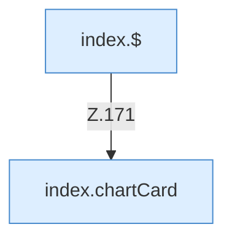

[[00 Start]] › [[Dashboard-UI]] › [[Legacy-Status]] › [[index.updateCharts]] › [[index.updateCharts.Teil2]]

# index.updateCharts.Teil2

```mermaid
flowchart TD
  n1["index.$"]:::internal-link
  n2["index.chartCard"]:::internal-link
  n1 -->|"Z.171"| n2
  classDef internal-link fill:#ddeeff,stroke:#4488cc
  classDef befund fill:#f88
```

- Fortsetzung von `index.updateCharts`, Quellreihenfolge.
